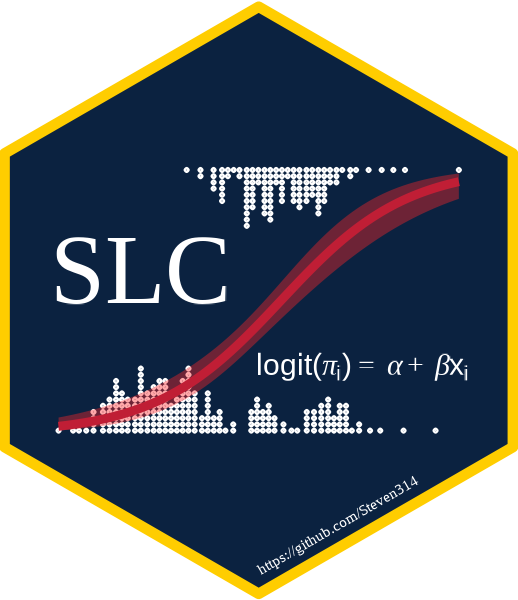

## Hello

I'm some mixture of Data Scientist and Econometrician that is working as a Business Insights Analyst at the [University of Toledo](https://www.utoledo.edu/).
The majority of my work is done in [R](https://www.r-project.org/).
Specifically, [Quarto](https://quarto.org/) and [Shiny](https://shiny.posit.co/) to build analytical reports and dashboards.
I also use SQL and [Python](https://www.python.org/) on occasion.

Prior to my BI Analyst work, I developed software to run experiments in [photovoltaics research](https://www.utoledo.edu/research/pvic/) as well as scripts to analyze that experimental data.

Outside of my academics and work, I am a Christian and a runner.
I regularly run the AV equipment at my church, and have created a few niche tech solutions there utilizing a [Raspberry Pi](https://www.raspberrypi.com/).
I also use [Obsidian](https://obsidian.md/) regularly to take notes in my personal studies and recordkeeping.

I use a Colemak keyboad layout on a [ZSA Moonlander](https://www.zsa.io/moonlander).
My current layout is available here: [Oryx](https://configure.zsa.io/moonlander/layouts/jYavJ/latest/0).
